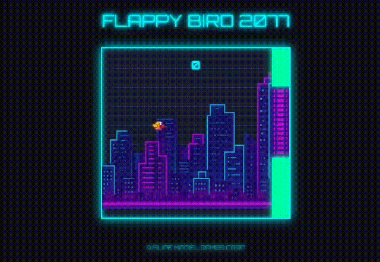

# 🐦 Flappy Bird 2077 – Cyberpunk Arcade Experience

> **Navegue pelos arranha-céus neon de Night City e teste seus reflexos em uma releitura futurista do clássico Flappy Bird.**

[](https://developer.mozilla.org/pt-BR/docs/Web/HTML)
[](https://developer.mozilla.org/pt-BR/docs/Web/CSS)
[](https://developer.mozilla.org/pt-BR/docs/Web/JavaScript)
[](https://tailwindcss.com/)
[](https://fontawesome.com/)

---

## 🚀 Sobre o Projeto

**Flappy Bird 2077** é um jogo arcade de estética **cyberpunk**, ambientado em um mundo **distópico** inspirado em Night City.  
Foi desenvolvido com **HTML, CSS e JavaScript puros**, focando em **desempenho e jogabilidade fluida**.

🎯 **Objetivo**: guiar seu pássaro cibernético pelos obstáculos neon, testando seus reflexos e resistência à dificuldade crescente.

---

## 📸 Demonstração

| Tela Inicial                                 | Gameplay                                  |
| -------------------------------------------- | ----------------------------------------- |
|  |  |

---

## ✨ Recursos

- **🎨 Design Imersivo** – paleta neon (azul-ciano / rosa choque) e tipografia _Orbitron_
- **⚡ Efeitos Visuais** – scanlines, grids animados e brilho neon
- **🎮 Jogabilidade Melhorada**
  - Controles responsivos (clique ou espaço)
  - Geração procedural de obstáculos
  - Dificuldade progressiva
- **🚀 Performance Otimizada** – código JavaScript puro, sem dependências pesadas

---

## 🛠️ Tecnologias Utilizadas

| Tecnologia         | Função               |
| ------------------ | -------------------- |
| HTML5              | Estrutura do jogo    |
| CSS3 + TailwindCSS | Estilização e layout |
| JavaScript Vanilla | Lógica e mecânica    |
| Font Awesome       | Ícones               |
| Google Fonts       | Tipografia           |

---

## 💻 Como Executar Localmente

```bash
# 1. Clone o repositório
git clone https://github.com/FilipeMaciel9000/flappybird-2077.git

# 2. Acesse a pasta
cd flappybird-2077

# 3. Abra o arquivo principal
start index.html  # Windows
open index.html   # macOS
xdg-open index.html  # Linux
```

---

\*\*## 🌐 Versão Online

[](https://FilipeMaciel9000.github.io/flappybird-2077/)
**Jogue agora:** [Flappy Bird 2077](https://FilipeMaciel9000.github.io/flappybird-2077/)\*\*

---

## 🤝 Contribuindo

Contribuições são bem-vindas!
Se deseja sugerir melhorias ou reportar bugs:

1. Faça um fork do projeto
2. Crie uma branch: `git checkout -b minha-melhoria`
3. Commit suas alterações: `git commit -m "Descrição da melhoria"`
4. Envie um Pull Request

---

## 📜 Licença

[](https://opensource.org/licenses/MIT)
Este projeto está sob a licença MIT — veja o arquivo [LICENSE](./LICENSE) para mais detalhes.
