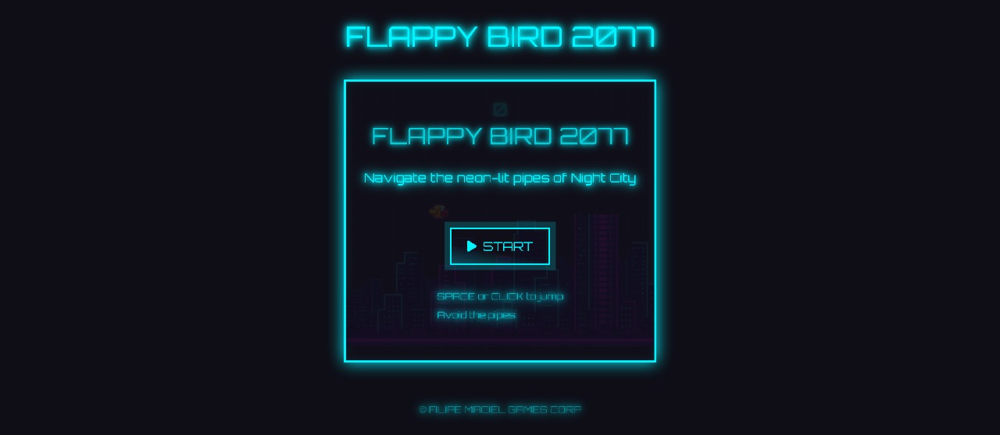

# 🐦 Flappy Bird 2077 – Cyberpunk Arcade Experience

### Navegue pelos arranha-céus neon de Night City e teste seus reflexos!

---

## 🚀 Sobre o Projeto

**Flappy Bird 2077** é uma releitura vibrante do clássico Flappy Bird, ambientada em um mundo **Cyberpunk distópico**.
Criado apenas com **HTML, CSS e JavaScript Vanilla**, o jogo combina mecânicas simples e viciantes com uma estética visual rica em **neon, efeitos futuristas e atmosfera imersiva**.

Seu objetivo é simples: guiar seu pássaro cibernético através dos canos iluminados de Night City, desafiando seus reflexos enquanto a dificuldade aumenta a cada ponto marcado.

---

## 📸 Demonstração

  
 

---

## ✨ Principais Recursos

- **Tema Cyberpunk Autêntico:** Paleta neon (azul-ciano, rosa choque, laranja e amarelo) e tipografia retrô (‘Orbitron’ e ‘Press Start 2P’) para uma atmosfera futurista.
- **Efeitos Visuais Dinâmicos:** Scanlines, grids animados, brilho neon e animações sutis para enriquecer a experiência.
- **Mecânica Fiel ao Original:** Gravidade, pulos responsivos (clique ou tecla espaço), geração procedural de canos e detecção de colisão.
- **Dificuldade Progressiva:** Velocidade e frequência dos obstáculos aumentam conforme o jogador pontua.
- **Interface Intuitiva:** Telas de início e fim de jogo, com botões estilizados e feedback de pontuação imediato.
- **Frontend Puro:** Sem dependência de frameworks JS complexos, priorizando código limpo e otimizado.

---

## 🛠️ Tecnologias Utilizadas

- **HTML5** – Estrutura base do jogo e UI.
- **CSS3** – Estilo, animações e responsividade.
- **Tailwind CSS** – Utilitários para layout e estilização rápida.
- **JavaScript (Vanilla)** – Lógica de jogo e interação do usuário.
- **Font Awesome** – Ícones de controle e interface.
- **Google Fonts** – Tipografia temática.

---

## 💻 Como Rodar Localmente

1. **Baixe os arquivos**
   No GitHub, clique em **"<> Code"** → **"Download ZIP"**.
2. **Extraia o conteúdo**
   Descompacte o arquivo ZIP em uma pasta de sua preferência.
3. **Abra no navegador**
   Dê duplo clique no arquivo `index.html` para iniciar o jogo.

---

## 📌 Status e Próximos Passos

O projeto já é **totalmente jogável**, mas algumas melhorias estão planejadas.

**Melhorias futuras:**

- Placar global (Leaderboard).
- Opções de personalização.
- Efeitos sonoros e trilha sonora temática.

---

## ❤️ Contribuindo

Quer ajudar? Sinta-se à vontade para **abrir issues**, sugerir melhorias ou enviar pull requests.
Feedback é sempre bem-vindo — toda sugestão ajuda o Flappy Bird 2077 a voar ainda mais alto!
